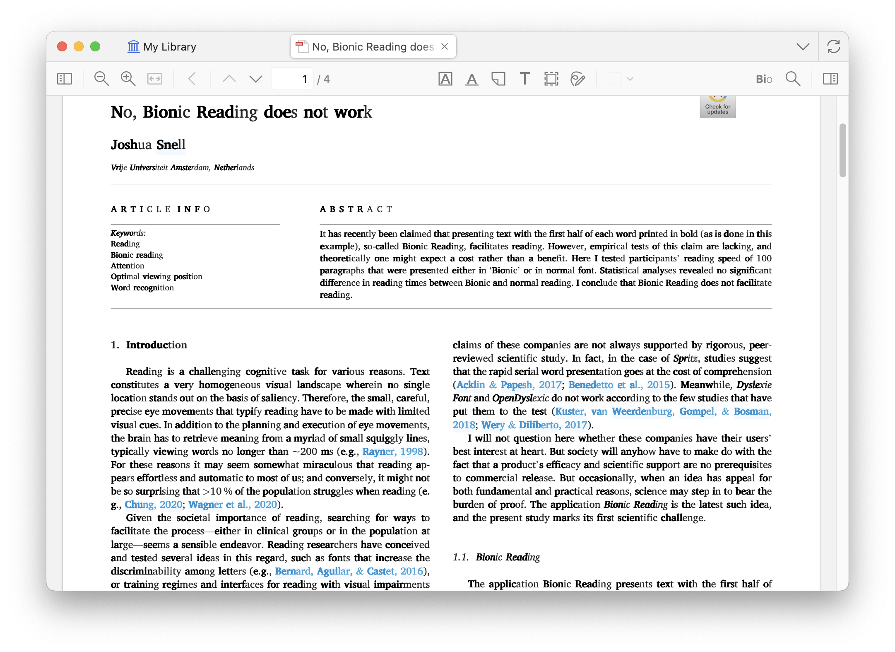
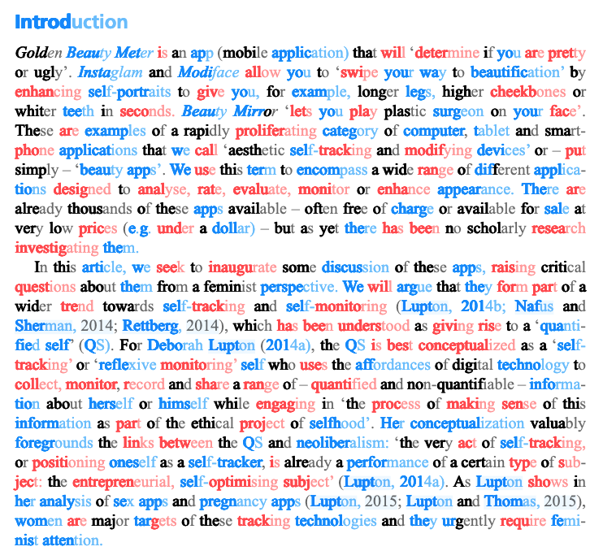

# Colorful Bionic

[](https://www.zotero.org)
[](https://github.com/windingwind/zotero-plugin-template)

**Color**ful **bio**nic **read**ing **exper**ience **wi**th **Zot**ero. **High**light **verb**s **an**d **nou**ns **i**n **differ**ent **colo**rs.

<div align=center></img></div>

### 学术论文阅读效果

<div align=center></img></div>

## 🧩 Outline

[🧐 What is this?](#-what-is-this)

[👋 Install](#-install)

[😎 Quick start](#-quick-start)

[🔧 Development](#-development)

[🔔 Disclaimer](#-disclaimer)

[🙏 Acknowledgements](#-acknowledgements)

[🤗 Contributors](#-contributors)

## 🧐 What is this?

Colorful Bionic is a Zotero plugin that implements a colorful bionic reading experience in the Zotero reader. It highlights verbs and nouns in different colors to enhance reading comprehension.

### What is bionic reading?

Bionic Reading is a reading method designed to make it easier and faster to comprehend text by guiding the reader's eyes through bolded initial letters of words. This technique emphasizes the beginning of each word, allowing the brain to "fill in" the rest of the word and phrase intuitively, leveraging cognitive shortcuts.

**A**s **sho**wn **i**n **th**is **sent**ence, **t**he **bol**ded **init**ial **lett**ers **o**f **ea**ch **wo**rd **a**re **us**ed **t**o **gui**de **t**he **read**er's **ey**es **thro**ugh **t**he **te**xt, **mak**ing **i**t **eas**ier **t**o **compr**ehend.

### Why bionic reading works/doesn't work?

The effectiveness of Bionic Reading is a subject of ongoing debate, largely because it depends on individual differences in reading habits, cognitive processing, and preferences.

Want to know more? Check out the latest research on [Google Scholar](https://scholar.google.com/scholar?q=bionic%20reading).

## 👋 Install

- Download the plugin (.xpi file) from below.

  - [Latest Stable](https://github.com/DrUsagi/Colorful-Bionic/releases/latest)
  - [All Releases](https://github.com/DrUsagi/Colorful-Bionic/releases)

  _Note_: If you're using Firefox as your browser, right-click the `.xpi` and select "Save As.."

- In Zotero click `Tools` in the top menu bar and then click `Plugins`
- Go to the Extensions page and then click the gear icon in the top right.
- Select `Install Add-on from file`.
- Browse to where you downloaded the `.xpi` file and select it.
- Finish!

## 😎 Quick start

1. Open a PDF in the Zotero reader.
2. The PDF will be displayed in bionic reading mode by default.
3. To toggle bionic reading mode and other features, use the `View` menu in the top menu bar or the BIO button in the toolbar.
4. You can highlight verbs and nouns in different colors to enhance comprehension.

## 🔧 Development

This plugin is built based on the [Zotero Plugin Template](https://github.com/windingwind/zotero-plugin-template). See the setup and debug details there.

To start, run

```bash
git clone https://github.com/DrUsagi/Colorful-Bionic.git
cd Colorful-Bionic
npm install
npm run build
```

The plugin is built to `./builds/*.xpi`.

## 🔔 Disclaimer

Use this code under AGPL. No warranties are provided. Keep the laws of your locality in mind!

## 🙏 Acknowledgements

Colorful Bionic是在[windingwind](https://github.com/windingwind)开发的[Bionic for Zotero](https://github.com/windingwind/bionic-for-zotero)插件基础上修改而来的。在此特别感谢windingwind的贡献和开创性工作，使这个增强版本得以实现。原插件提供了基本的Bionic阅读功能，而本版本增加了多彩词性高亮等功能。

## 🤗 Contributors

- DrUsagi (Current Maintainer)
- [windingwind](https://github.com/windingwind) (Original Author of Bionic for Zotero)
